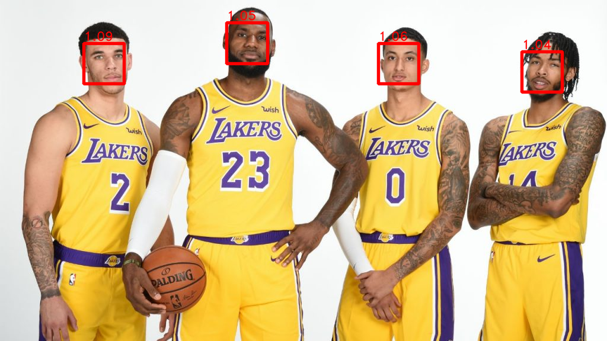

# Facial Landmark Detection

## System Environment

Unbuntu: 16.04

Python: 3.5

Dlib: 19.16.0

OpenCV: 3.4.1

## Example

- Face Detect: Detect and label the score of each face. Dlib provides facial detector which detects and returns the position of the faces. The text and rectangle are added with OpenCV built-in functions.

